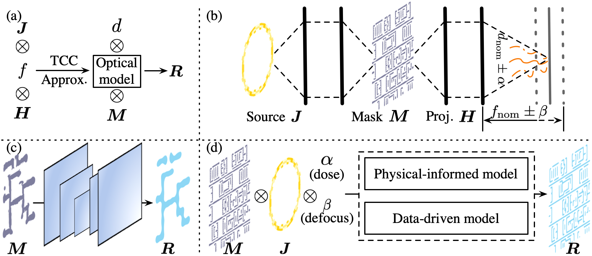

| Update Status                                                                                    | Contributors                                                                                                                                                             | Deployment Status                                                                                                                                                                                                                          |
| ------------------------------------------------------------------------------------------------ | ------------------------------------------------------------------------------------------------------------------------------------------------------------------------ | ------------------------------------------------------------------------------------------------------------------------------------------------------------------------------------------------------------------------------------------ |
|  |  |  |

# Overview

	 

>

<strong>Figure 1: (a). Lithography simulation tools by combining source and defocus on a fixed projector to create an optical model (a.k.a TCC), then using mask and dose inputs to generate resist. (b). Physical process for advanced optical lithography, resist imaging performance depends on source and mask quality, as well as dose and defocus fluctuations. (c). Previous benchmark (LithoBench, NIPS'23) at 45nm node ignored source, dose, and defocus effects, using DNNs for mask-to-resist generation. (d). Our benchmark at sub-28nm node considers simulation across wider mask ranges with source and process variations, using data-driven or physics-informed generative models for complete simulation.

	 

	<strong> Figure 2: </strong>LithoSim Benchmark Overview.

# Getting Started

# Models and Evaluation

## Baseline Models

## Evaluation Metrics

Check out the code and pre-trained models in our [Github repo](https://github.com/woodfrog/poly-diffuse).

# Project Structure

# Legal

LithoSim uses the Apache 2.0 license for code found on the associated GitHub repo and the CC BY-NC 4.0 license for data hosted on HuggingFace.  The LICENSE file for the repo can be found in the top-level directory.
